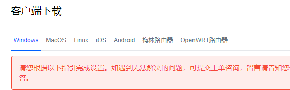

# 梯子软件全面测评，一款手机和电脑都能用的机场梯子，ios-windows-mac-安卓版本

### 本次测评所甄选的梯子来源于网友的一篇投稿，这位网友也是在网络上看到水友推荐了这款梯子，然后试用了一番感觉不错，于是在决定购买年费会员之前，联系到我，让我帮忙评估一下这款梯子软件是否靠谱。

我自然是答应了，为了进行全方位的机场梯子线路测评，自费开通了年费，针对该梯子后台的所有线路，进行逐一测速和评估。

## 梯子地址先给大家贴出来：[这里是官网](https://xbsj3462.fun/i/art022)

## 一、梯子是否靠谱的先决条件

对于一个梯子是否靠谱或者好用，一个先决条件就是它成立的年限，成立时间越长，提供服务的时长越久，那么梯子的靠谱程度就越高。

而我寻找一款梯子成立时间的方法也很简单，就是在各大搜索引擎当中输入梯子的名字，然后寻找其最早出现的痕迹。

这款梯子我综合了百度，谷歌，搜狗，360等搜索引擎的搜索情况，寻找到的最早出现痕迹在2017年5月份，所以大概推测其成立时间至少在四年以上，有可能更早，单从这一点来看，我对其的疑虑就打消了大半，毕竟如果是一个快餐梯子机场，基本存活时间都不会大于一年。

其次我登录他们官网查看了服务条款和隐私政策，除却一些各大机场通用的陈词外，没有什么别的问题，不保存用户数据，不侵犯用户隐私等等条例也都有注明。

单从第一印象来说，这个梯子还算是比较靠谱的一类。

## 二、梯子节点和线路类型

这个自然不必多说，节点和线路的类型能够直观反映出梯子团队的更新维护积极性以及在成本控制方面是否小气。

这家梯子的节点类型如下：

所有节点以Trojan和V2ray为主，没有ssr节点，这种节点分布类型，还是比较适应当前这个网络环境的，ssr节点在目前这种状况下并不合用，我自己也早在去年开始使用Trojan和V2ray节点，这一点开来，团队的更新维护速度方面是没有太大问题的。

其次看线路类型，这一点确实让我有点惊喜，因为基本都是IEPL专线，这类型专线的成本很高，举个例子，如果让我自己个人去租用IEPL线路的话，我肯定是租不起的。

在目前市面上大部分机场都是中转的情况下，这个机场使用了IEPL直连专线，性能上肯定是要超过其友商了。最直观的一点优势在于，如果未来的某一天，墙再度加高或者升级，其他中转机场都无法使用的情况下，采用IEPL专线的机场依然能够坚挺。

从这个方面而言，这家机场已经给了我一个不小的惊喜。

## 三、支持的客户端

这个没有什么好说的，就是看他的客户端支持是否全面，毕竟现在大家使用的工具多样性比较大，能够全面支持各平台运行的梯子，能够提供更好的便利度以及为我们省钱。

这家支持的客户端涵盖了windows，mac，安卓，ios，Linux等主流平台，足够使用。

## 四、速度测试

接下来就是进入正题了，决定一款梯子的优劣，最直观的，就是测试它的速度，我测速所用的是windows电脑，环境如下：

工具：window10电脑

网络：电信100M宽带

测速平台：SpeedTest/Youtube

以SpeedTest平台开始，我分别选择了，香港，美国和日本的节点，进行了第一次测试：

香港节点：

美国节点：

日本节点：

总体上而言，三者的速度差别不大，都是比较快的，在我使用过的机场中，这个速度表现也已经算很不错，其中以香港节点表现最佳。

接着选择Youtube的4K画质测速专用视频给大家看下情况：

跑出来的数据也相当不错。

## 五、测评的最终结果

最终这款梯子综合各方面的表现，我建议那位网友可以选择他们家的年费会员，成立时间足够久，确保了稳定性，节点线路丰富和高效，说明团队的更新维护速度快，节点的测速表现也很优异，证明了使用体验非常好，综合这几点，这款[梯子还是好用靠谱的](https://www.linkedin.com/pulse/%E4%BE%BF%E5%AE%9C%E5%A5%BD%E7%94%A8%E7%9A%84%E6%89%8B%E6%9C%BA%E7%94%B5%E8%84%91%E6%A2%AF%E5%AD%90%E6%8E%A8%E8%8D%90%E7%BB%99%E5%A4%A7%E5%AE%B6%E7%A8%B3%E5%AE%9A%E5%AE%89%E5%85%A8%E9%80%9F%E5%BA%A6%E5%BF%AB-%E5%A4%A7%E5%8D%83-%E5%BC%A0/?published=t)，可以放心冲。
